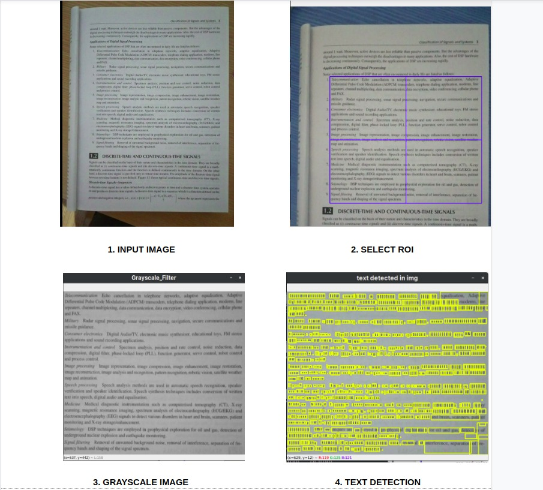
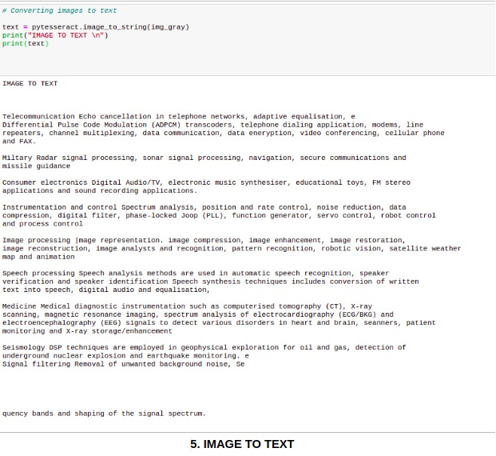

# OCR Text Recognition  
       
### INTRODUCTION

Texts are everywhere ( in form of PDF's , images captured by digital camera ,scanned documents etc.). 
Analysis of textual data is useful in lots of applications including Document Scanner and OCR, reciept OCR , data entry for business documents (eg : cheque , bank statement , passport) . A system cannot read or recognize any text directly from an image. That is why Optical Character Recognition (OCR), an open-source Tesseract OCR Engine, to detect text from images.
Optical character recognition (OCR) is a technology for extracting textual data from scanned paper documents , PDF files or images (.jpg/.png) and then converting the text into editable and searchable data .

### LIBRARIES USED

    1. cv2
    2. numpy 
    3. matplotlib
    4. pytesseract

### MAIN FEATURES

      1. Reading image from given path.
      2. Cropping of unwanted area using ROI(Region of Interest) selector.
      3. Pre-processing(includes scaling,binarization ,noise removal etc..) of the cropped image.
         NOTE : Pre-processed can have higher accuracy .
      4. Text detection of pre-processes image.
      5. Converting images into text.
### ADVANTAGES 

     1. Makes Documents editable and searchable.
     2. Document Scanner and OCR
     3. Makes analysis of textual data easier in reciept OCR, data entry for cheque statements and passports.
      
### GOALS
     1. Increased accuracy.
     2. Reducing manual work for selecting area of interest.
     3. OCR text Recognition in PDFs.
     4. All the detected texts will be returned in the form of audio format (to help visually impaired)

### WORKING 
 
 
 
 
 

      
    
### INSTALLING LIBRARIES 
   1. Opencv can be installed by running " pip install pytesseract " in your favorite shell.
   2. Pytesseract is installable using Python package manager tool pip by running pip install pytesseract.
   
### CODE EXECUTION INSTRUCTIONS
    1. Download the image and put it in the same foldet where OCR_Text_Recognition.ipynp is placed. 
       Or give proper image path
    2. Run the IPython Notebook section wise .
    
### LIMITATIONS

1. Doesn’t do well with images affected by artifacts including partial occlusion, distorted perspective, and complex background.
2. It is not capable of recognizing handwriting.
3. Poor quality scans may produce poor quality OCR.

### CONCLUSIONS
Tersseract is perfect for scanning clean documents and comes with pretty high accuracy and font variablity since its training was comprehensive.

### REFERENCES 
     1.https://www.pyimagesearch.com/2017/07/03/installing-tesseract-for-ocr/
     2.https://github.com/tesseract-ocr/tesseract
     3.https://www.learnopencv.com/how-to-select-a-bounding-box-roi-in-opencv-cpp-python/

